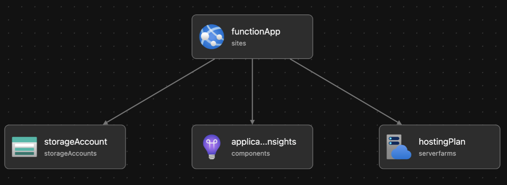

# Azure Function App with Python using Bicep

- [Bicep](https://docs.microsoft.com/en-us/azure/azure-resource-manager/bicep/overview?tabs=bicep)
- [Azure Functions](https://docs.microsoft.com/en-us/azure/azure-functions/functions-overview)




# Usage

```shell
RESOURCE_GROUP=myprojectnameresourcegroup
NAME=myprojectname
LOCATION=westeurope

az group create --name ${RESOURCE_GROUP} --location ${LOCATION}

RESOURCE_GROUP=${RESOURCE_GROUP} NAME=${NAME} LOCATION=${LOCATION} make deploy
``` 
